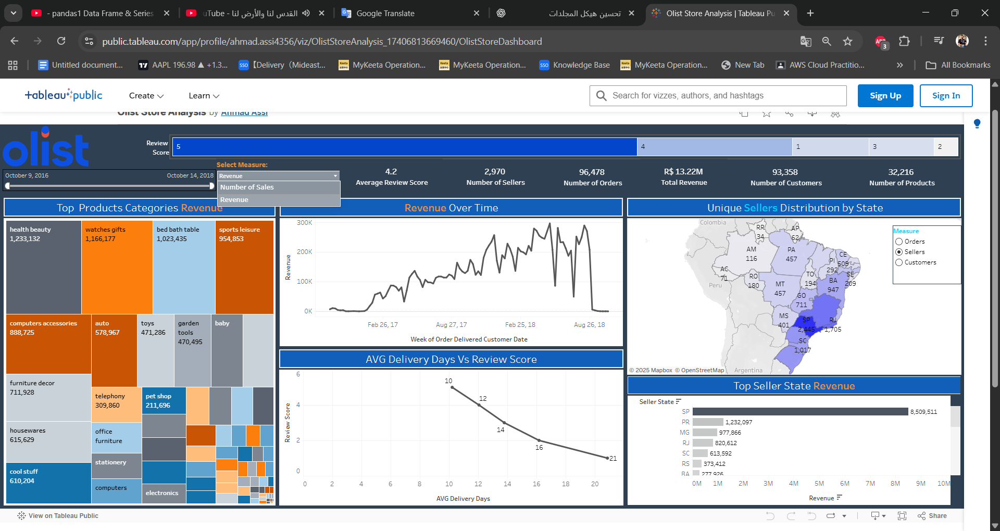

# Olist Store Analysis

Comprehensive analysis of Olist Store data to understand customer behavior, quality of shopping experience, and the impact of shipping delays on ratings.
---

## Project Objective
Analyzing Olist store data to extract insights into: - The relationship between delivery delays and negative reviews. - The performance of different product categories. - Sales patterns and key performance indicators (KPIs).
---

## project structure

Olist E-Commerce-Analysis 
│ 
├── 01_description_scoping/ 
│ ├── Portfolio - Project Description & Scoping.pdf 
│ 
├── 02_data_curation/ 
|
│   ├── Project - Data Curation.pdf 
|
│   ├── SQL_Queries
|      ├── oliststore1.sql
|
│   ├── cleaned_data
|       ├── customers.csv
|       ├── order_items.csv
|       ├── orders.csv
|       ├── Products.csv
|       ├── sellers.csv
│ 
├── 03_exploratory_analysis/
| 
│   ├── Project EDA.pdf 
|  
│   ├── EDA Excel Sheets
|       ├── customers.xlsx
|       ├── order_items.xlsx
|       ├── orders.xlsx
|       ├── Products.xlsx
|       ├── sellers.xlsx
│ 
├── 04_final_report/ 
|
│   ├── Project - Final Report.pdf 
│ 
├── 05_Datafolio_and_ Dashboard/
|
│        ├── Project Datafolio & Dashboard.pptx
│        ├── Olist Store Analysis.twbx
│        ├── dashboard_preview.png
│
├── 06_Data_raw/
|
|       ├── olist_customers_dataset.csv
|       ├──  olist_geolocation_dataset.csv
|       ├──  olist_order_items_dataset.csv
|       ├──  olist_order_payments_dataset.csv
|       ├──  olist_order_reviews_dataset.csv
|       ├──  olist_orders_dataset.csv
|       ├──  olist_products_dataset.csv
|       ├──   olist_sellers_dataset.csv
|       ├──   product_category_name_translation.csv
└── 

## Tools Used
- Excel for data cleaning and preprocessing
- SQL for data extraction and analysis
- Tableau for data visualization
---

## 📊 🔗 🔗 [View Interactive Dashboard on Tableau Public](https://public.tableau.com/app/profile/ahmad.assi4356/viz/shared/43R7KMQKF)

